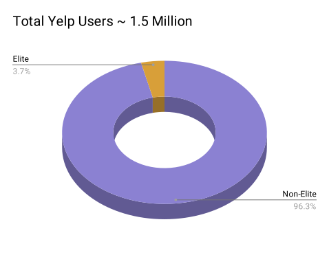

# Yelp Eliteness

Analyzing Yelp user data using machine learning (SVM) to determine Yelp's Eliteness criteria

<!--  -->

## What is Yelp Elite?

Directly from their [site](https://www.yelp-support.com/article/What-is-Yelps-Elite-Squad?l=en_US):
> The Yelp Elite Squad is our way of recognizing people who are active in the Yelp community and role models on and off the site. Elite-worthiness is based on a number of things, including well-written reviews, high quality tips, a detailed personal profile, an active voting and complimenting record, and a history of playing well with others.

Unfortunately, Yelp does not state explicit eligibility and requirements to achieve Elite status. Given a representative user dataset, can we leverage machine learning to determine Yelp's Eliteness criteria?

## Dataset

The [Yelp Open Dataset](https://www.yelp.com/dataset) contains of over 1.5 million users. Approximately **3.7%** of those users are Elite users.

An equal-weighted 50k random subsample was used for the analysis.  
* 25k Non-Elite users
* 25k Elite users

## Methodology

## Results

## Limitations