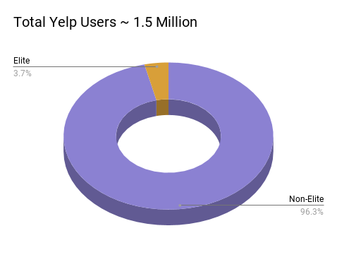
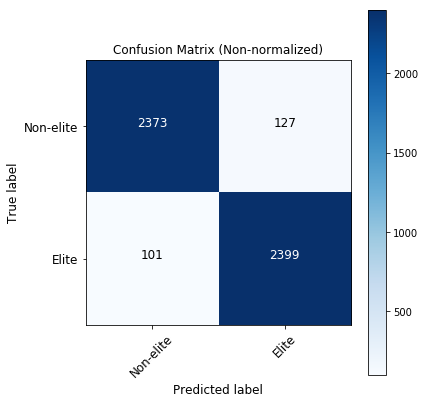
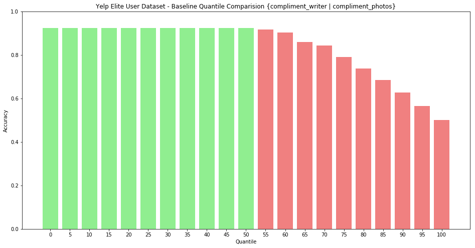
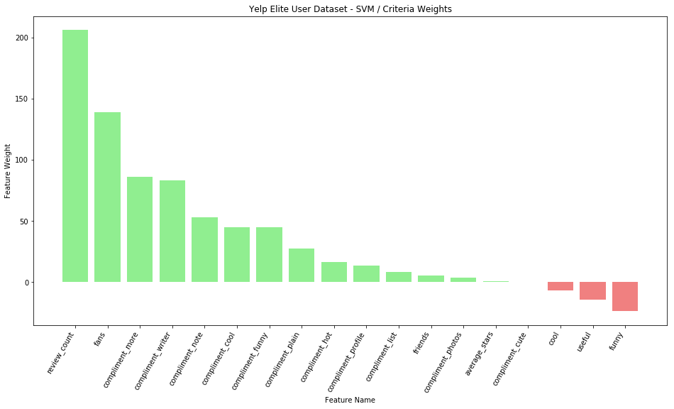
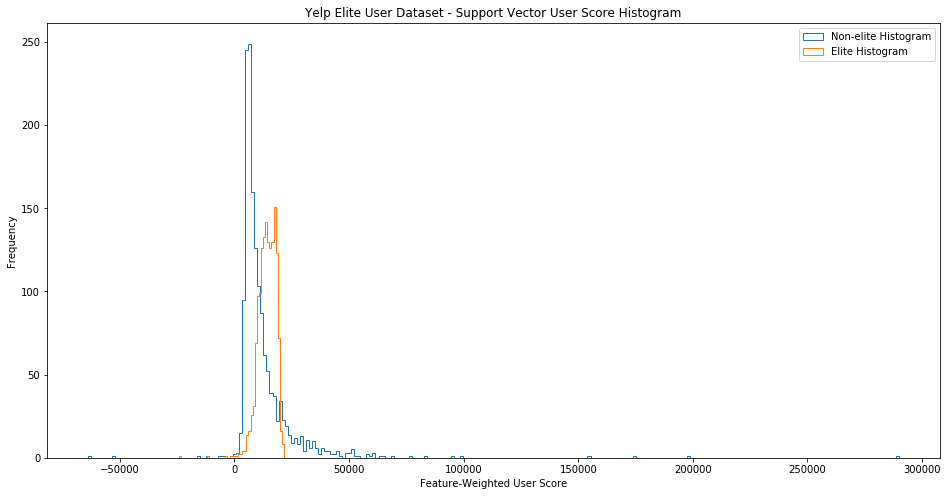

# Yelp Eliteness

Analyzing Yelp user data using machine learning (SVM) to determine Yelp's Eliteness criteria

<!--  -->

**TL;DR**: a prospective Elite user will need on average **70 reviews** to meet the average Elite user score.

## What is Yelp Elite?

Directly from their [site](https://www.yelp-support.com/article/What-is-Yelps-Elite-Squad?l=en_US):
> The Yelp Elite Squad is our way of recognizing people who are active in the Yelp community and role models on and off the site. Elite-worthiness is based on a number of things, including well-written reviews, high quality tips, a detailed personal profile, an active voting and complimenting record, and a history of playing well with others.

Unfortunately, Yelp does not state explicit eligibility and requirements to be an Elite user. 

Given Yelp's user dataset, can we leverage machine learning to determine Yelp's Eliteness criteria?

## Dataset

The [Yelp Open Dataset](https://www.yelp.com/dataset) contains of over 1.5 million users. Approximately **3.7%** of those users are Elite users.

An equal-class-weighted 50k random subsample was used for the analysis.  
* 25k Non-Elite users
* 25k Elite users

Dataset documentation can be found [here](https://www.yelp.com/dataset/documentation/main).

## Methodology

An approach using a linear SVM classifier (SVC):
1. Apply normalization using MinMaxScaler
2. Create a *80|20* : *training|test* stratified split
2. Find best C with StratifiedKfold cross-validation using the training set, where K = 5
3. Fit the SVC with the best C using the training data
4. Predict on the test data
5. Compare prediction to a baseline
6. Analyze SVC coefficients to determine Eliteness criteria
7. Analyze support vectors to quantify Eliteness

## Results

The SVC had a **95.44%** accuracy classifying non-Elite and Elite users.

### Baseline Comparison

Predicting the majority class will yield 50% accuracy since the subsample is equal-class-weighted and the splits are stratified.

Intuition tells us users whom receive *compliment_writer* **or** *compliment_photo* should be Elite users by the quality of their reviews.

The best baseline accuracy achieved was **92.32%**, indicated by the green bars in the figure above. 
> The baseline accuracy is suspiciously close the SVC accuracy. However, this comes as no surprise since the majority of non-Elite users receive zero compliments and the majority of the users in the data set are non-Elite. 

### SVM Feature Weights

*review_count* was the strongest indicator for Eliteness, while *funny* votes sent by the user was the most negative indicator for Eliteness.
> Advertising is Yelp's primary business model - to drive user conversion rates. Yelp wants their user reviews to influence the site visitor's decision to spend money at a business. Thus, the product is the crowd-sourced user reviews. More user reviews translate to a more valuable platform. 
>
> (Opinion) Let's assume the majority of site visitors are not using Yelp for entertainment. The site visitors are looking for quality reviews to help them make decisions. A user browsing Yelp for fun is not looking to make a spending decision. Intuitively, funny votes sent by the user do not necessary lead to a conversion. 

Exact features weights can be found in the [notebook](yelp_eliteness-support_vector.ipynb).

### Support Vector Analysis

Out of the 40k users in the training set, **3,057** were support vectors.

| Support Vector Type | Count	|
|---	              |---  	|
| Non-elite           | 1529    |
| Elite 	          | 1528	|

Equipped with the SVM feature weights, we can assign a value to each user using the following formula:  
~~~python
for user in support_vectors:
    user_score = sum(feature_value * feature_weight for feature_value, feature_weight in zip(user.iteritems(), svm.coef_))
~~~

The table below shows the user score simple statistics for each support vector class.

| Score Type |  Mean	|  std 	|  Min 	 |  Max   |
|---	     |---	    |---	|---	 |---	  |
| Non-elite  | 12306    | 14586 | -64014 | 290110 |
| Elite 	 | 14007	| 3730 	| -24043 | 21585  |

The graph below shows the support vector user score histogram:

Using the strongest indicator for Eliteness, a prospective Elite user will need on average **70 reviews** to meet the average Elite user score.

## Limitations

False negatives:  
> Eliteness is self-nominated. Some users might qualify for Elite status but did not apply.
>
> This is an unavoidable / distinct characteristic of the dataset that can reduce classification accuracy.

Annual Elite status:
> Eliteness only lasts for one year, the user must reapply annually. The preprocessing converts the *years Elite* to the binary class attribute.
>
> The requirements for Eliteness may change year-to-year. The analysis does not account for the user score evolution over time. Unfortunately, the dataset only provides a user's aggregate summary.

Dataset quality:  
> The Yelp Open Dataset itself is a subset of Yelp's data. The documentation does not specify the data inclusion methodology. What decides whether a user is included or excluded from the open dataset?
>
> The dataset could include an implicit bias or skew that is not representative of the population.

## Comments

Most SVM libraries recommend a [hard normalization](https://www.csie.ntu.edu.tw/~cjlin/papers/guide/guide.pdf), mapping the min and max values of a given dimension to [0,1]. However, a [soft normalization](https://neerajkumar.org/writings/svm/), using StandardScalar(), might also be feasible.  
With a soft normalization, *review_count* is replaced by *compliment_review* received by the user as the strongest indicator for Eliteness. The value of this indicator is also not as extreme.

The dataset makes no indication of a user's Elite application results. It would be nice to know whether a user was accepted or rejected for Eliteness.